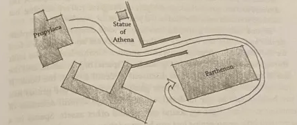
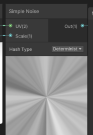
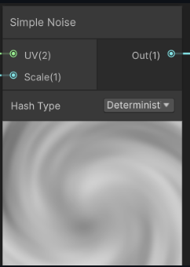
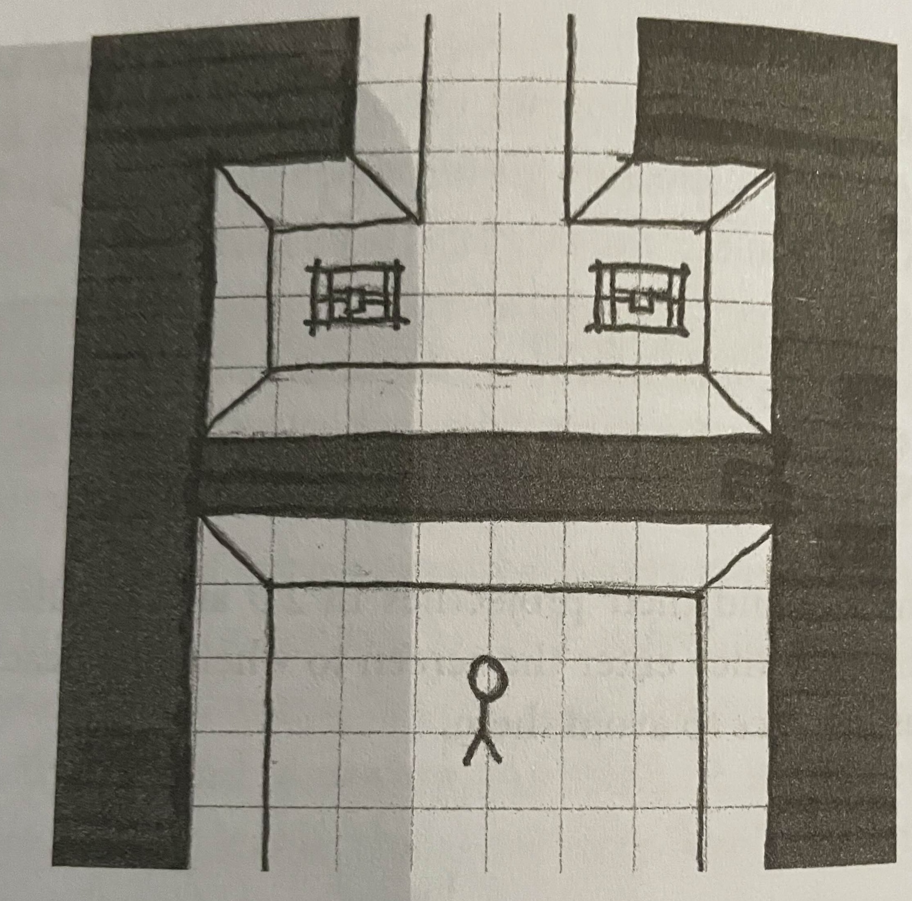
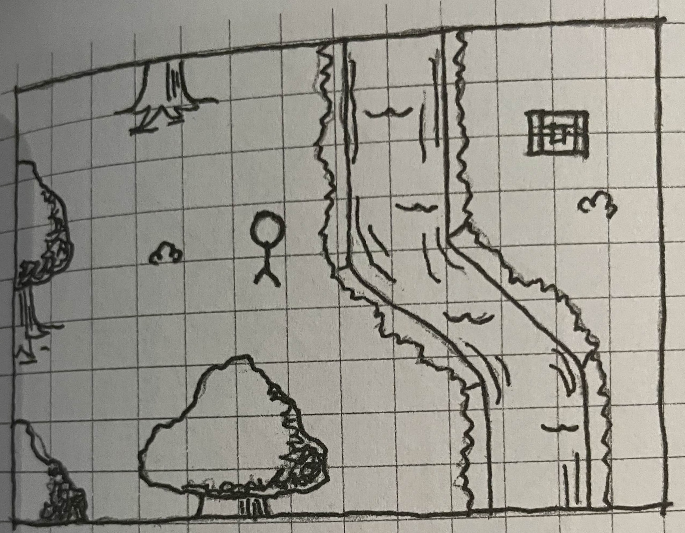

# Level design for infinitely generated worlds

In this research I'm looking into how to make the bridge between intentional & clean level design towards infinitely procedural world generation. This subject has interested me pretty deeply over the last few months and I'm excited to dive deeper into it. This research will mostly be from a game designers perspective but I will also be looking out for possible solutions for implementing certain level design principles.

*Note: This is by no means my final product, consider it more of a scratchbook where I write out my conclusions and ideas that will later be molded into a respectable thesis and hopefully an amazing demo!*
## Architectural spartial arrangements

Source: An Architectural perspective to level design page: 104 - 112

### Arrivals
A very interesting topic I just have to note down is **Arrivals**. As the book states "Level esign is an art of sight lines, pathways, dramatic lead-ups, and ambiguity about the nature of where you are going.". Much of the communication to the player happens through the arrival in a space.

A big subject I now want to write about is the long round way around walking to the Patrthenon. I find this to be a very interesting concept that has a lot of potential to be implemented procedurally.

The idea is on how the road forces you to walk around the building seeing it from all angles, from afar from the side from the back really building up the moment you finally get in front. I find this a very nice way to giving players a goal and to build up anticipation procedurally!

When building a procedural world in simple terms: As I want to work with a modular principle like minecraft the world will be cut into different parts where different worlds can spawn upon. Imagine I want to make a world that has a "Parthenon" type building in the center. If I where to wrap the uv's of the mountains around this building towards the center using a neat function named Arctangent2

Now our mountains are pulled to the center of the world, so what if instead of just traight mountains we can just twirl hat same vector, yeah ofcorse that's possible !

Now we spawn mountains that delay your path but give way for differences in height, we can move the center to be more to the back for longer walks or closer by so the start of the area is more visible from other regions, the ending can be in an elevated position or maybe its deep under ground, either way using smoothstep in the center area we can smoothly make the mountains blend with our building in the center!

This might work!!!

There is still a lot to go through here but I'l excited to try this out!

## Considerations of camera

Source: an architectual approach to level design 144-155

Another very interesting subject is the consideration of camera! Speicically the example of how side scrolling games and top down games can show players things that the player character cannot nessesairly see.

As my game will be a volumetric 3D world I like to think in that perspective but ofcorse this means an idea like that would be impossible. But I really like the idea of teasing a potential loot drop or maybe impactful area before you can reach it... Like a hot or cold effect, imagine you are a robot looking for energy sources, you are exploring a cave and you get an energy reading, just like bluetooth from your phone goes through the walls you can also notice readings, ofcorse as you get closer the connection will get stronger until it gets so close you can even see it through walls!

**BEHOLD MY CRAZY CONCEPT ART, MY PREPROCESSING TEACHER WOULD DEFINITLY SHOOT ME** (Altough he's like one of the most wholesome teachers ever, I think he'd have a giggle and say "well at least I see what you mean")

Anyway! As we are making the bridge between infinitely procedurally generated worlds and good level design what does thinking about this do for that goal? Well stuff can be all over the place, imagine you walk in a dungeon to loot, as it could function as an extra stimulus to explore, you explore a dungeon slay monsters and then learn deep down (can even pick up signals from below you) is some rare item. Yes could definitly work in a non procedural world that's for sure! But the longer I think about good game design in procedural worlds, the more I believe I should just consider it more as a big open world where you have no clue what's going on like without any walkthrough or anything over just an open world. I'm starting to feel like helping the player navigate this messy space and guiding them through the game over an uniquely generated path etc is what makes a procedural world shine! In my enquete many people decided that exploration is the most important thing for them in open world games so level design that encourages exploration gives goals etc will be a beautiful addition to this research!

## Spartial arrangements

Source: An Architectual Approach to Level Design: 104 - 109

There was this one part that really made me think, a quote from an architect named Grant Hildebrand:
"The brain expects future event-and-image sets to be event-and-image sets previously experienced. When repetition of previous experience seems likely, the brain readies itself to reexperience the set. If expectances are confirmed, the model is reinforced, with a resultant sensation of pleasure."

Wellllllllllll, does it have to be in such complicated language... I asked ChatGPT to translate it to.. Well my language: MrGPT says: "Your brain likes patterns.
When it thinks something is going to happen, it looks for events and images it has seen before.

If the brain believes the next moment will be the same kind of moment it has already experienced, it gets ready to relive that familiar pattern.

And when the brain guesses correctly and the situation does match what it expected, the brain gets a little reward signal.
This reward feels like pleasure, because the brain thinks
“Nice! I predicted that right.”

Which is kinda what I interpreted it as but it confuses me quite hard. So a game should be predictable to reward the player? Maybe its just me but if I predict something I get bored of it, my last 3 relationships didn't work because I always knew what my girlfriend was thinking so I got kinda bored, everything always went as predicted. Until I met my currently girlfriend, she's crazy unpredictable and honestly sometimes that pisses me off soo hard. Soo hard in fact it took me 5 months to realise how much I liked her. But when I did accept that her unpredictability was actually what attracted me I realised how fun it is to have some notion, some expectation but still never be truly sure. She can be at my door right now to suprise me and I'd me super suprised because its 22:30, dark outside and I told her not to go outside alone in the dark but still the notion that it could happen is exciting because I don't know. Even though I do know she won't be there the fact that I can never know for sure is exciting. 

So what is this Grant Hildebrand trying to say, because he definitly understands more about design than I do if I base his quote on my messy love life...

Source https://gettherapybirmingham.com/the-predictive-mind-karl-fristons-free-energy-principle-and-its-implications-for-consciousness/#:~:text=The%20Free%20Energy%20Principle%20and%20Predictive%20Coding&text=According%20to%20Friston%2C%20the%20brain,errors%20(Friston%2C%202010).
https://www.frontiersin.org/journals/human-neuroscience/articles/10.3389/fnhum.2010.00025/full
https://neurosciencenews.com/novelty-prediction-neuroscience-28409/

So I WENT IIIIIIIIIIIIIIIINNNN WE HITTING NEUROSCIENCE... (Or whatever damn weird thing this is) DAMN THAT MONSTER ENERGY CAN IS HITTING!

 
Well there are 2 types of brains to consider when building a world ort whatever they name it:
- Prediction Brain
- Novelty Brain

On my thesis I'm definitly basing this better on papers etc but for now to lead the way for myself:

Prediction brain is what the quote is describing. Its all about patterns, safety, being right, predictability etc etc, honestly I need this a lot on my life. I hate unexpected twists, I just want everything to be as expected, that's why I'm obsessed about code and writing it very cleanly because code is predictable and if you write it shit it becomes unpredictable and prediction brain won't get happy, shit'll be frustrating.

So why do I love my girlfriend if I need this consistency of being able to recognise patterns?

Well guess I have a novelty brain too and it seems that it's very strong for me my novelty side likes suprise, mystery, the unknown, the emotional spikes (PLEASE FEMKE NO MORE) etc. It gets me a way bigger dopamine hit getting the unexpected. 

But as I'm writing shit one thing becomes clear. Levels can be both!
See I have the best girlfriend in the world and she found a way around this mess of a person that's me. As I clearly have a big need for predictability knowing what's coming yet I need to be suprised she worked around it and combined the 2 together. I know something unpredictable is coming but I won't be able to guess. Its not to unpredictable that its frustrating imagine at random intervals you get jumped by some random monster, no scene grows dark anticipation hit your prediction brain turns on you know something is coming but you don't know what but you know something is there triggering both your sides. anticipation you know something will happen and you are prepared you predict it but you can't guess what you get suprised while still hitting that sweet read of "Yes I knew it". Well as I'm writing this I'm actually a bit mad at my girlfriend cuz she was way to harsh about the board game I proudly presented to her (Also very unpredictable), bot god dammit I fckn love you and I hope you never forget that!

Well how do I do this procedurally? Well I guess that's something environmental storytelling can answer. But I guess adding stuff like fog thickening or sound will be pure gold!