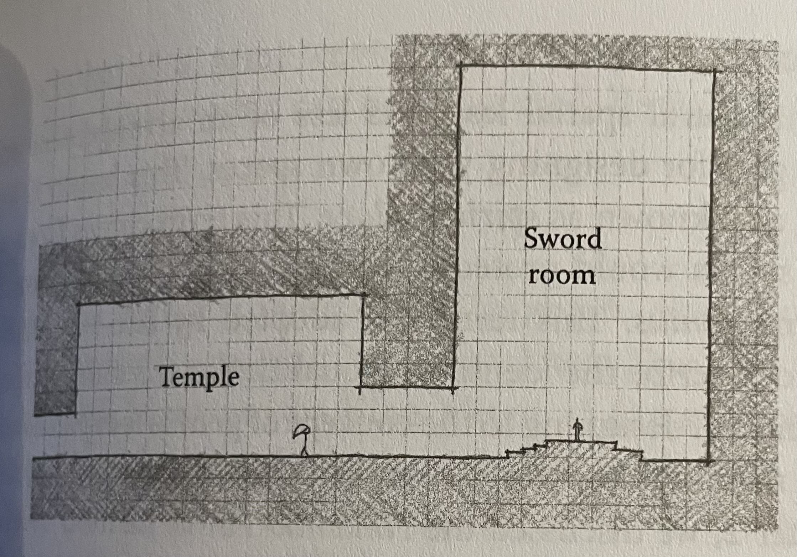
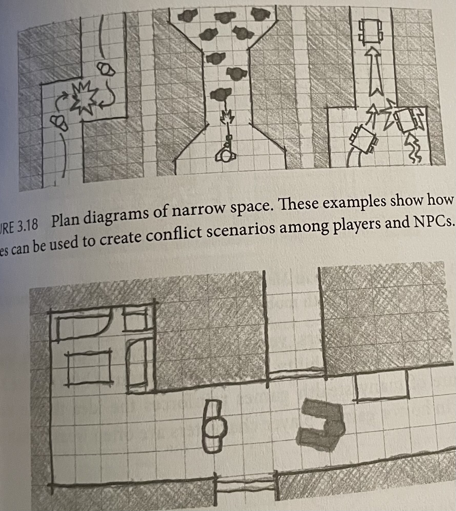
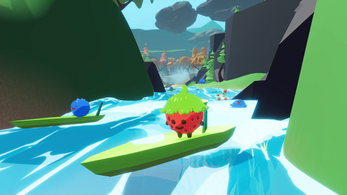

# Level design for infinitely generated worlds

In this research I'm looking into how to make the bridge between intentional & clean level design towards infinitely procedural world generation. This subject has interested me pretty deeply over the last few months and I'm excited to dive deeper into it. This research will mostly be from a game designers perspective but I will also be looking out for possible solutions for implementing certain level design principles.

*Note: This is by no means my final product, consider it more of a scratchbook where I write out my conclusions and ideas that will later be molded into a respectable thesis and hopefully an amazing demo!*
## Architectural spartial arrangements

Source: An Architectural perspective to level design page: 104 - 112

### Arrivals

#### Parthenon
A very interesting topic I just have to note down is **Arrivals**. As the book states "Level esign is an art of sight lines, pathways, dramatic lead-ups, and ambiguity about the nature of where you are going.". Much of the communication to the player happens through the arrival in a space.

A big subject I now want to write about is the long round way around walking to the Patrthenon. I find this to be a very interesting concept that has a lot of potential to be implemented procedurally.

The idea is on how the road forces you to walk around the building seeing it from all angles, from afar from the side from the back really building up the moment you finally get in front. I find this a very nice way to giving players a goal and to build up anticipation procedurally!

When building a procedural world in simple terms: As I want to work with a modular principle like minecraft the world will be cut into different parts where different worlds can spawn upon. Imagine I want to make a world that has a "Parthenon" type building in the center. If I where to wrap the uv's of the mountains around this building towards the center using a neat function named Arctangent2

Now our mountains are pulled to the center of the world, so what if instead of just traight mountains we can just twirl hat same vector, yeah ofcorse that's possible !

Now we spawn mountains that delay your path but give way for differences in height, we can move the center to be more to the back for longer walks or closer by so the start of the area is more visible from other regions, the ending can be in an elevated position or maybe its deep under ground, either way using smoothstep in the center area we can smoothly make the mountains blend with our building in the center!

This might work!!!

There is still a lot to go through here but I'l excited to try this out!

#### Jesus Christ spot

Well arrivals is a very interesting topic so I shall now bestow some more words to this subject! As I believe the arrivals seem like the more feasible procedural implementations when considering all the nasty technicalities I'll be going through!

An interesting line I'd like to remember: "If you are arriving in a big space, spaces leading up to it should be encosed so the new space seems even bigger, light spaces should be precided by dark etc."
Interesting stuff so basically you make something pop by having the exact opposite before it? Nothing new but very good to note and also doesn't sound to bad to implement!

So there is this this hotel named "Haytt Regency Atlan ta hotel and it has an atrium space dubbed the "Jesus Christ spot" that I will proudly dub the J-spot for the rest of this document!
The effect is that as you walk into the hotel  it starts small with lower ceilinged spaces and as you walk outside it gets soo high that you mutter "Jesus Christ!" as you look upward.

This is implemented in games like The Legend of Zelda and Metroid series.
Below a picture of how it would look in a side view.

I have seen this effect many times in games, even though I'm now genuinely to physically disabled to enjoy most games. I remember swimming around in Subnautical and encountering big caves with beautiful light after having to dive down deep through narrow tunnels to get there, only now I can truly understand how this is done, its not just about the diffence between start and end but also as you see in the picture the suddeness, you are looking at the sword when you come in, you can't see what's above you and as you walk in your view grows and you see everything. Its like an exponent you go from nothing to almost seeing everything instantly.
Its such a simple concept with soo much more depth than you can just come up with!

## Considerations of camera

Source: an architectual approach to level design 144-155

Another very interesting subject is the consideration of camera! Speicically the example of how side scrolling games and top down games can show players things that the player character cannot nessesairly see.

As my game will be a volumetric 3D world I like to think in that perspective but ofcorse this means an idea like that would be impossible. But I really like the idea of teasing a potential loot drop or maybe impactful area before you can reach it... Like a hot or cold effect, imagine you are a robot looking for energy sources, you are exploring a cave and you get an energy reading, just like bluetooth from your phone goes through the walls you can also notice readings, ofcorse as you get closer the connection will get stronger until it gets so close you can even see it through walls!

**BEHOLD MY CRAZY CONCEPT ART, MY PREPROCESSING TEACHER WOULD DEFINITLY SHOOT ME** (Altough he's like one of the most wholesome teachers ever, I think he'd have a giggle and say "well at least I see what you mean")

Anyway! As we are making the bridge between infinitely procedurally generated worlds and good level design what does thinking about this do for that goal? Well stuff can be all over the place, imagine you walk in a dungeon to loot, as it could function as an extra stimulus to explore, you explore a dungeon slay monsters and then learn deep down (can even pick up signals from below you) is some rare item. Yes could definitly work in a non procedural world that's for sure! But the longer I think about good game design in procedural worlds, the more I believe I should just consider it more as a big open world where you have no clue what's going on like without any walkthrough or anything over just an open world. I'm starting to feel like helping the player navigate this messy space and guiding them through the game over an uniquely generated path etc is what makes a procedural world shine! In my enquete many people decided that exploration is the most important thing for them in open world games so level design that encourages exploration gives goals etc will be a beautiful addition to this research!

## Spartial arrangements

Source: An Architectual Approach to Level Design: 104 - 109

There was this one part that really made me think, a quote from an architect named Grant Hildebrand:
"The brain expects future event-and-image sets to be event-and-image sets previously experienced. When repetition of previous experience seems likely, the brain readies itself to reexperience the set. If expectances are confirmed, the model is reinforced, with a resultant sensation of pleasure."

Wellllllllllll, does it have to be in such complicated language... I asked ChatGPT to translate it to.. Well my language: MrGPT says: "Your brain likes patterns.
When it thinks something is going to happen, it looks for events and images it has seen before.

If the brain believes the next moment will be the same kind of moment it has already experienced, it gets ready to relive that familiar pattern.

And when the brain guesses correctly and the situation does match what it expected, the brain gets a little reward signal.
This reward feels like pleasure, because the brain thinks
“Nice! I predicted that right.”

Which is kinda what I interpreted it as but it confuses me quite hard. So a game should be predictable to reward the player? Maybe its just me but if I predict something I get bored of it, my last 3 relationships didn't work because I always knew what my girlfriend was thinking so I got kinda bored, everything always went as predicted. Until I met my currently girlfriend, she's crazy unpredictable and honestly sometimes that pisses me off soo hard. Soo hard in fact it took me 5 months to realise how much I liked her. But when I did accept that her unpredictability was actually what attracted me I realised how fun it is to have some notion, some expectation but still never be truly sure. She can be at my door right now to suprise me and I'd me super suprised because its 22:30, dark outside and I told her not to go outside alone in the dark but still the notion that it could happen is exciting because I don't know. Even though I do know she won't be there the fact that I can never know for sure is exciting. 

So what is this Grant Hildebrand trying to say, because he definitly understands more about design than I do if I base his quote on my messy love life...

Source https://gettherapybirmingham.com/the-predictive-mind-karl-fristons-free-energy-principle-and-its-implications-for-consciousness/#:~:text=The%20Free%20Energy%20Principle%20and%20Predictive%20Coding&text=According%20to%20Friston%2C%20the%20brain,errors%20(Friston%2C%202010).
https://www.frontiersin.org/journals/human-neuroscience/articles/10.3389/fnhum.2010.00025/full
https://neurosciencenews.com/novelty-prediction-neuroscience-28409/

So I WENT IIIIIIIIIIIIIIIINNNN WE HITTING NEUROSCIENCE... (Or whatever damn weird thing this is) DAMN THAT MONSTER ENERGY CAN IS HITTING!

 
Well there are 2 types of brains to consider when building a world ort whatever they name it:
- Prediction Brain
- Novelty Brain

On my thesis I'm definitly basing this better on papers etc but for now to lead the way for myself:

Prediction brain is what the quote is describing. Its all about patterns, safety, being right, predictability etc etc, honestly I need this a lot on my life. I hate unexpected twists, I just want everything to be as expected, that's why I'm obsessed about code and writing it very cleanly because code is predictable and if you write it shit it becomes unpredictable and prediction brain won't get happy, shit'll be frustrating.

So why do I love my girlfriend if I need this consistency of being able to recognise patterns?

Well guess I have a novelty brain too and it seems that it's very strong for me my novelty side likes suprise, mystery, the unknown, the emotional spikes (PLEASE FEMKE NO MORE) etc. It gets me a way bigger dopamine hit getting the unexpected. 

But as I'm writing shit one thing becomes clear. Levels can be both!
See I have the best girlfriend in the world and she found a way around this mess of a person that's me. As I clearly have a big need for predictability knowing what's coming yet I need to be suprised she worked around it and combined the 2 together. I know something unpredictable is coming but I won't be able to guess. Its not to unpredictable that its frustrating imagine at random intervals you get jumped by some random monster, no scene grows dark anticipation hit your prediction brain turns on you know something is coming but you don't know what but you know something is there triggering both your sides. anticipation you know something will happen and you are prepared you predict it but you can't guess what you get suprised while still hitting that sweet read of "Yes I knew it". Well as I'm writing this I'm actually a bit mad at my girlfriend cuz she was way to harsh about the board game I proudly presented to her (Also very unpredictable), bot god dammit I fckn love you and I hope you never forget that!

Well how do I do this procedurally? Well I guess that's something environmental storytelling can answer. But I guess adding stuff like fog thickening or sound will be pure gold!

## Spartial Size types

Source: An Architectual Approach to Level Design: 118 - 125

Well gang, I have sad news for many of ma bro's out there (But none for me, well actually too much is also not good sometimes) but size does matter!
Not just any size... SPARTIAL SIZE!!! So what is it I have no clue??? Game Space size? The book talks bout 3 different size types. I guess big, medium and small....
We'll figure it out as we go!

### Narrow Space

A space where the player feels confined and unable to move. 
According to the book these spaces should not be larger than a player characters own size metrics.

Narrow spaces create tensionn by giving space scarcity, space becomes a valuable resource.

As space is narrow comfrontation becomes more inevitable it creates tension and that prediction brain we talked about earlier (OMG SO THATS WHY THIS IS SPARTIAL SIZE TYPES AND EARLIER ABOUT SPARTIAL ARRANGEMENTS ITS ALL COMING TOGETHER!!!)
It readies the player to be ready for something, not because they know something will come, nothing can come but you humanly just get more uncomfortable as space becomes limited and your movements are limited.

5 months ago I found such an amazing game design thing that basically almost killed me in Majorca! We went diving at the rocks and our guide told us "You can dive the tunnel there and you can find something amazing" (Well guess I was almost about to find myself in heaven)
The tunnel there he talked about was... WELL THERE WHERE 2 TUNNELS AND ONE WAS NOT SAFE!!!! Well guess what, I just learned the hard way how far you can pull this Narrow game design shit. As I dove that fckn tunnel instead of enemies scaring me to kill me I was running out of air, I was in a narrow fckn tunnel full of sharp edges completely fucking me over while I was already 45 seconds under water with no end in sight, no way of turning because shit was too fckn narrow and sharp and a girlfriend I deeply loved waiting for me unknowing she was about to experience one of my signature near death experiences for the first time! Yeah I was scared af but I stayed calm the narrow space was fucking me over the pressure of no breath was scaring me but I only had one option: go forward stay calm to not hit my head or fuck myself over and hope for the best as I focussed on moving forward slowly but quickly. Part of it was experience with almost dying often another part was human instinct, I had no other choice but to go forward because I didn't want to die and the narrow space was scaring the shit outa me, then I saw air again "HOZAAAAAAAAAAAAAAAAAAAAAAAAAHHHH" world never looked so massive to me!!!! So how's that for a setup to a massive J-spot!!!!

I luckily I survived with just a few scratches and bruises

Anyway this pressure can come in many ways and honestly I love using my own real life examples to understanding these concepts, its such a nice way to understand concepts this way.
I don't know if my way of writing everything down that comes to mind is something that works for others, but for me it really helps with putting my mind in order!

### Intimate Space

Basically not confining not large. Its made to comfortably support the movement of the character in relation to its size. Interactive surfaces and features are within (hee player reach, like wall jumping etc. Its the type of area you enjoy jumping around in as you enjoy just join then nice design of a character! I assume these are the most common spaces.
The book also talks aboutmultilateral intimate space where you are in a multiplayer game with nosignificant advantage points.

These spaces have several beneficial effects like their comfortable accessibility as they are considered friendly often. Assuming in procedurally generated world they can also be created as a safezone in a horde of enemies.
I guess a nice example would be this amazing art piece I made using some cool lava environment I found on SketchFab: https://sketchfab.com/3d-models/low-poly-lava-world-05919a399a8c47ebbf56822ef2bac7d3

Imagine you are in a big lava area full of monsters but when generating one of those difficult areas there are spots you can crawl into on the side maybe? Like safe spaces, they are clearly seperated from the rest of the area but still part of it, you see walls around you and know enemies can't reach, it has some areas you can move around in, maybe some loot but all by all its safe, it phases the game right before you are about to have to fight through big hordes, I feel like when working procedurally generating random Intimate spaces all ove the world isn't nessisairy to put level design in but more of like a failsafe to give players a time to phase back, on purpose to catch some air, change their characters or maybe not because in the past you conditioned them that Intimate spaces like these can bring you rewards or maybe lore of like characters that died hiding there or whatever! Its such a nice consistent way of telling story while slowing down the pace procedurally!!!

### Prospect Space

Guess this is for tomorrow, the Monster wore out...

Alright new day new monster time to get back to work!
The third space we are talking about is the Prospect space, and it handles another feeling of being uncomfortable! 
Rather than being in a closed space where you can't move freely you are in an open space where you have all the space to move but too much space to truly know what's all going on on your surroundings.

According to mr Hildebrand: "A prospect space as that in which humans and too historically find food, water and other necessities - Outsiode of the safety of caves and open to predators and the elements.
Prospect spaces are used for boss rooms: larhge open spaces where the player cannot use his or her abilities to take a spatil advantage but must instead fight a single poweful foe.

Well as I'm writing this maybe I understyood prospect space wrong, its not about the size but rather what's not in it

Anyway so I started googling. As this book is like all about architecture that was exactly the direction I went in!

Source: https://landarchconcepts.wordpress.com/what-is-prospect-refuge/
I stumbled upon this:

So here we go back all the way to 1975 where the prospect refuge theory was developed by a guy named Jay Appleton. The core idea is: Humans prefer environments where they can see without being seen. so yeah we are taking the right direction with this!
Usally I tend to be very hesitant with using old sources but honestly when we think about architecture I feel like people in the past knew their shit well enough to take their works as reference.

Look I'm all for modern buildings, honestly I think modern houses are very cool actually, those white cubes stacked in random ways, I'm not gonna lie, I think it looks cool. But when it comes to architecture and conveying emotion and spaces and stuff, there is no way I'd ask a modern architect to tell me more about the subject when there's books written by people who designed these massive stone buildings without the resources we have today and still make themselves seem like a more advanced sivilisation than we are today!

Anyway now that I made my point why I prefer looking at older stuff over new stuff lets se what the article talks about!:
According to this article there are 2 spartial types (well we saw three but I assume the narrow space is not included in this theory).
- Prospect spaces: Spaces with outward views, visibility and a sense of oversight
- Refuge spaces: Shelter encolure and protection

But on these fundamentals there are differences:
- Prospect refuge spaces: spaces where you have both visibility and shelter at the same time
- Edge & boundary spaces: The transition nbetweenn openn and enclosed spaces: Edges naturally create a spot for refuge
- Enticement spaces: This is kinda invented by designners, its a refuge space what feels obscured but it suggests something is beyond so it is to entices movement inside
- Hazard spaces: honestly this is what I thought prospect was at first, an area where you are in high exposure, no defined bounndary without protection or cover

Now that I got some more architectual knowledge back to the book!
The book talks about how simmilar to narrow spaces prospect spaces have potential for creating fear in the player (Like especially the Hazard spaces).
Having too much vision in a prospect space as mentioned earlier means you can't see everything that's around you unlike a refuge/intimate space giving you a sense of insecurity, it feels good to have a sense of oversight but on the other hand take that oversight away with no end and your prospect space becomes a lot scaried. Hold my monster I'm opening up photoshop!

As you can see both are prospect spaces, one where you can see everything another one where your view is narrowed (honestly theres a lot of factors you can't really capture in an image as you have edges around you etc but sorry its a picture)
But what if I take away your view and replace it with mist! We are still in a prospect space but outa nowhere you can't see ur environment anymore and kaboom now things get scary!!!
Wait you thinnk I was gonna make my own fog over it? Well I tried but I got wat to invested and I actually am on a schedule so I decided to just show another example!

But yeah same prospect space and even though one has their view significantly narrowed and it really adds to the atmosphere.
Reminds be back to the Siren head days. Anyway this was a very interesting subject to dive into and I'll definitly take it with me. Seems like Prospect spaces aren't inheritly scary and actually provide security, until you have nothing at your back or no way to go and nothing to see coming, then tension goes up. That definitly explains why we just happily run around in Minecraft without a worry even at night, take away the view and replace it with heavy fog and play the game for the first time and lets see how comfortable you walk around at night through the good ol' plains field!

Still very interesting notion on how to create and relieve tension through phasing. Force a player to walk to a big castle in the middle of an open field, when its foggy you are hitting that tension meter as you are in the middle of an open space with no walls or anything in sight and tension goes op. Or slow phasing down and give full vision and out of nowhere its just a comfortable walk where you can take your breath! Very interesting, like for procedural generation this is actually pure gold when I think about it, these kind of things can be applied to the same area and you can really base it on what the player experienced before it! if the previous area was comfy you can generate it it without fog and danger, but if he just came out of a safe zone generate the area with fog and monsters!!!

Letsgooooooooooooooooooooooooooooooooooooooooo, big win!

## Sandbox  Gamespaces
Source: An architectual approach to level design p135 - 

Probably the most relevant part I've touched on right now for me as the book says: In single player games, developers create the feeling of large open world by utilizing sandbox gamespaces. Sandbox worlds are named for their ability to have defined boundaries but also allow players to play however they want in less structured ways than many other games allow.

So here something already kinda contradicts: "Definded boundaries" well sadly no smart explanation it just doesn't fit it seems, but I googled "Is Minecraft a sandboox game?" and Mr Google said "yes". I assume the definition definitly varries because I also consider Minecraft a sandbox game but hey that's why I think this is hyper relevant. I feel like the core concept of a Sandbox game being highly customisable with no mandatory goals and a lot of freedom very accurate for my research, so hey what does the book tell us?

### Architectual Weenies
Before I start disecting the part I first want to dive deeper in the concept of "Architectual Weenies"! What are they? Well the book says they are an integral part of sandbox spaces. They allow these worlds to retain their openess but still direct players to places that designers want them to go. An often mentioned example is sleeping beauty's castle, its the big thing that pulls your attention, it invites you in and sets a goal on where to go.
My personal idea of a very obvious architectual weenie is that big golden tree in Elden ring, its like the one thing you see everywhere, the one thing that tells you without guide where to go, you get attracted to it like a fly to a lamp as you march through the world with no clue what its actually for, to this day I still don't know if I could have actually reached it... But god dammit did I keep chasing that tree for hours!

The basica idea of architectual weenies is to move the player towards a goal, I have no clue if we can have multiple architectual weenies or how that works but I think its possible. Earlier in *Considerations of camera* I concluded a big part of infinite procedurally generated worlds need some kind of guidance to make it work with good level design and I bet Architectual Weenies will contribute to this idea in such a massive way!

### Organizing the sandbox: Kevin Lynch's Image of the City

Finding your way in a large open space is daunting so there are quite some organization principles on how to structure urban spaces. There is this book named "The Image of the City" which is the resulkt of a 5 year study of how people form mental maps of cities. We will hit each individual part and figure out how they influence your mental map!

#### Landmarks
Landmarks are kinda like Architectual weenies in a sense that they are a guidepost to people in an urban space. It a convenient way to pull the players attention to it but also allows the player to orient themselves.
Ofcorse this is not just for urban styled games, landmarks can be anythin g like natural objects or human made elements that contrast well with the landscape!

An interesting landmark, I mean I guess it is it definitly is an architectual weenie is how that sunken ship makes you check out towards it where you get absolutely fucked up by your first leviathan class monster!
What makes it also interesting is how the front is way further away from you than the back making you go towards that side which is exactly where the developers wanted you to be to put some real fear inside of you!

#### Paths
Well paths are what you'd think of paths, in urban spaces you can see them as: Roads, sidewalks and other matters of transport like over water in venice!!!
Its sole purpose is usually to guide a player to the next point. But another example mentioned is Elder Scrolls, they don't represent their sandboxes as large urban spaces but as open landscapes. Seems like their paths between towns, dungeons etc would be large open spaces. But how do I call this a path? Well actually as stated in the book they use subtle geagoraphic features like dirt paths, signposts or even rivers to invoke some notion of direction in areas without a clear path. Its important to remember that paths aren't just looking nice but truly make a difference on how the player explores the world.

Cmon! I just had to have a feature of the game of the year contender "The Life of Mr Pips" is it too far fetched that a strawberry surfing a leaf over water is a good example of good path design?
Well actually I don't think it does because I don't consider "The Life of Mr Pips" a sandbox game, but god dammit Mr Pips goes beyond game design so I'll put it in!

#### Nodes
I actually have no clue how 